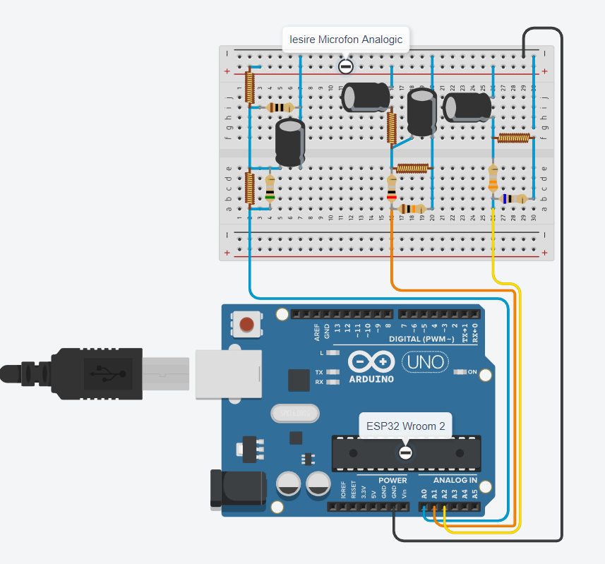
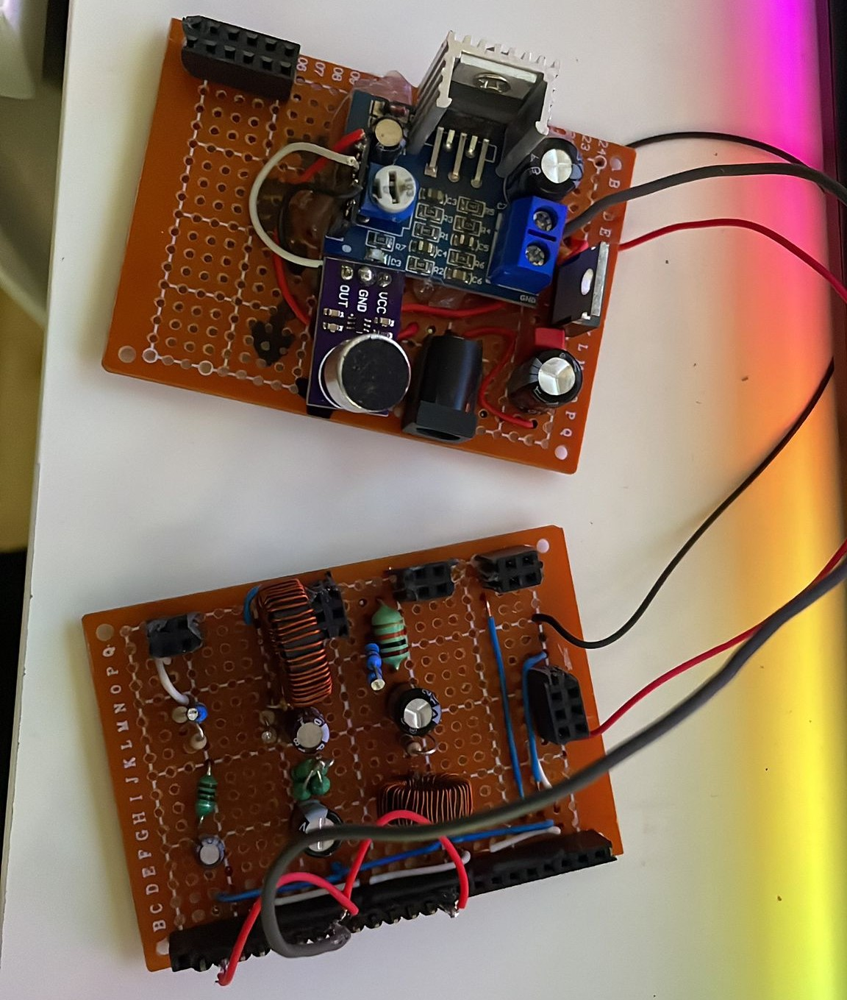
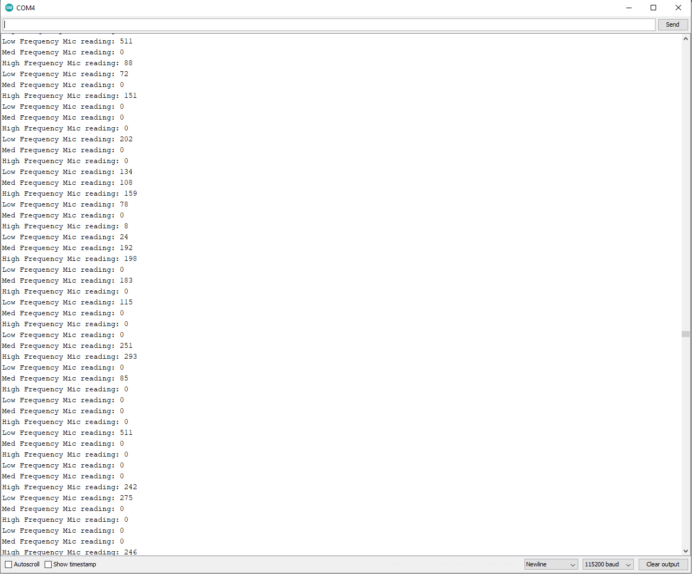

# Vumetru 
## Scurta descriere

In cadrul acestui proiect am dezvoltat un sistem ce contine 3 tipuri de filtre care sa separe sunetul receptat in functie de frecventa acestuia:
- Filtru Trece Jos pentru frecvente joase
- Filtru Trece Baza pentru frecvente medii
- Filtru Trece Sus pentru frecvente inalte

Dispozitivul este compus dintr-un microfon analogic, a carui iesire este conectata la un amplificator audio. Iesirea amplificatorului este conectata in paralel la celel trei filtre mentionate anterior. 
Intreg modulul este alimentat cu ajutorul unei surse de 12V 2A, care este conectata la un circuit de step-down la 5V.
Iesirile celor trei filtre sunt conectate la intrarile analogice ale controller-ului ESP32 Wroom 2



## Modelul de functionalitate

### Procesarea multi-core

Am folosit componenta multi-core a microcontrollerului utilizand un nucleu pentru a procesa citirea informatilor primita de la cele 3 filtre, si al 2lea nucleu pentru a mapa valorile si a afisa pe matricea de leduri.

Codul folosit este urmatorul:

```cpp
//create a task that will be executed in the Task1code() function, with priority 1 and executed on core 0
  xTaskCreatePinnedToCore(
                    Task1code,   /* Task function. */
                    "Task1",     /* name of task. */
                    10000,       /* Stack size of task */
                    NULL,        /* parameter of the task */
                    1,           /* priority of the task */
                    &Task1,      /* Task handle to keep track of created task */
                    0);          /* pin task to core 0 */                   
  //create a task that will be executed in the Task2code() function, with priority 1 and executed on core 1
  xTaskCreatePinnedToCore(
                    Task2code,   /* Task function. */
                    "Task2",     /* name of task. */
                    10000,       /* Stack size of task */
                    NULL,        /* parameter of the task */
                    1,           /* priority of the task */
                    &Task2,      /* Task handle to keep track of created task */
                    1);          /* pin task to core 1 */
  delay(500); 
```

### Receptarea si procesarea sunetului

O data ce sunetul este receptat de catre microfon si filtrat prin acest set, valorile de intensitate de sunet pentru fiecare categorie de frecvente sunt transmise catre microcontroller. In plus am implementat o marja de zgomot pentru afisare (valorile citite mai mici de 3).



```cpp
void Task2code( void * pvParameters ){
  Serial.print("Task2 running on core ");
  Serial.println(xPortGetCoreID());
   while(1){
      L = analogRead(lowFMic);
      if(L < 3)
        L = 0;
      M = analogRead(medFMic);
      if(M < 3)
        M = 0;
      H = analogRead(highFMic);
      if(H < 3)
        H = 0;
      
      /*
      Serial.print("Low Frequency Mic reading: ");
      Serial.println(L);
      Serial.print("Med Frequency Mic reading: ");
      Serial.println(M);
      Serial.print("High Frequency Mic reading: ");
      Serial.println(H);
      */
      
      delay(20);
  }
}
```





### Maparea pentru afisarea valorilor

Aici preluam valorile primite in urma citirii si le mapam pentru afisarea pe coloanele de leduri.

Prin mapare, luam o plaja de valori intre minim si maxim (in urma testelor am ales marja de eroare 3 pentru minim si 300 ca valoare maxima receptata) si asociem acestor valori citite o valoare intre 1 si 9 care sa reprezinte fiecare led aprins.

```cpp
void Task1code( void * pvParameters ){
  Serial.print("Task1 running on core ");
  Serial.println(xPortGetCoreID());
  
  int intensitate = 0;
  
  while(1){
    intensitate = map(L, min_intensitate, max_intensitate, 1, 9);
    lc.setRow(0,7, coloana[intensitate]);
    lc.setRow(0,6, coloana[intensitate]);
    
    intensitate = map(M, min_intensitate, max_intensitate, 1, 9);
    lc.setRow(0,4, coloana[intensitate]);
    lc.setRow(0,3, coloana[intensitate]);
    
    intensitate = map(H, min_intensitate, max_intensitate, 1, 9);
    lc.setRow(0,1, coloana[intensitate]);
    lc.setRow(0,0, coloana[intensitate]);

    delay(20);
  }
}
```

### Afisarea valorilorilor

Pentru optimizarea procesului, am ales sa folosim doar cele 6 coloane pentru afisare. O data ce mapam o valoare de la 1 la 9 pentru intensitatea sunetului, transmitem catre matrice un sir de biti care sa reprezinte numarul de led-uri ce trebuie aprinse.

Acest lucru se face prin functia `lc.setRow` ce preia din urmatoarea lista valoarea pe biti descrisa:
```cpp
byte coloana[9] = { B00000000, B00000001, B00000011, B00000111, B00001111, B00011111, B00111111, B01111111, B11111111 };
```


### Galerie foto
</img> 
</img> 
</img> 
